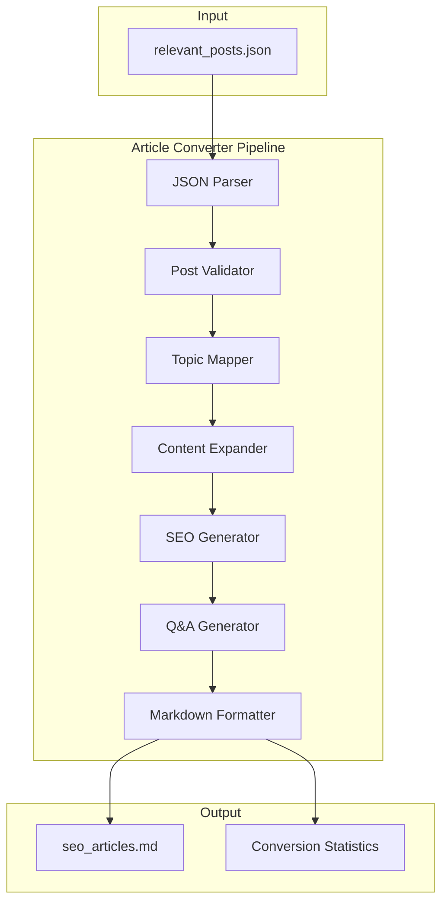

# Design Document: Instagram to SEO Articles Converter

## Overview

מערכת להמרת פוסטים מאינסטגרם למאמרי SEO מלאים בעברית. המערכת מקבלת קובץ JSON עם פוסטים מאינסטגרם ומייצרת קובץ Markdown עם מאמרים מותאמי SEO בסגנון הכתיבה של אביטל רוזן. הארכיטקטורה מבוססת על pipeline של עיבוד: קריאה → וולידציה → המרה → פלט.

## Architecture



## Components and Interfaces

### 1. JSON Parser

```typescript
// src/lib/converter/jsonParser.ts
interface InstagramPost {
  id: string;
  topic: TopicType;
  raw_caption: string;
  image_url: string;
  user_questions: string[];
}

type TopicType = 
  | 'Treatment' 
  | 'Anti-Inflammatory' 
  | 'Lymphedema' 
  | 'Nutrition' 
  | 'Diagnosis' 
  | 'General Lipedema';

interface ParseResult {
  success: boolean;
  posts: InstagramPost[];
  errors: ParseError[];
}

interface ParseError {
  index: number;
  field: string;
  message: string;
}

function parseInstagramPosts(jsonContent: string): ParseResult {
  // Parse JSON and validate structure
}
```

### 2. Post Validator

```typescript
// src/lib/converter/postValidator.ts
interface ValidationResult {
  valid: boolean;
  reason?: string;
}

interface ValidatedPost extends InstagramPost {
  isValid: boolean;
  skipReason?: string;
}

function validatePost(post: InstagramPost): ValidationResult {
  // Check for non-empty caption (not just hashtags)
  const captionWithoutHashtags = post.raw_caption
    .replace(/#\w+/g, '')
    .trim();
  
  if (!captionWithoutHashtags) {
    return { valid: false, reason: 'Caption contains only hashtags' };
  }
  
  return { valid: true };
}

function isHashtagOnly(caption: string): boolean {
  const withoutHashtags = caption.replace(/#[\w\u0590-\u05FF]+/g, '').trim();
  return withoutHashtags.length === 0;
}
```

### 3. Topic Mapper

```typescript
// src/lib/converter/topicMapper.ts
type CategorySlug = 'diagnosis' | 'nutrition' | 'physical' | 'mindset';

interface CategoryMapping {
  slug: CategorySlug;
  display: string;
}

const TOPIC_TO_CATEGORY: Record<TopicType, CategorySlug> = {
  'Treatment': 'physical',
  'Anti-Inflammatory': 'nutrition',
  'Nutrition': 'nutrition',
  'Lymphedema': 'diagnosis',
  'Diagnosis': 'diagnosis',
  'General Lipedema': 'mindset',
};

const CATEGORY_DISPLAY: Record<CategorySlug, string> = {
  'diagnosis': 'אבחון וזיהוי',
  'nutrition': 'תזונה ונוטריציה',
  'physical': 'טיפול פיזי ושיקום',
  'mindset': 'מיינדסט ורגש',
};

function mapTopicToCategory(topic: TopicType): CategoryMapping {
  const slug = TOPIC_TO_CATEGORY[topic];
  return {
    slug,
    display: CATEGORY_DISPLAY[slug],
  };
}
```

### 4. SEO Generator

```typescript
// src/lib/converter/seoGenerator.ts
interface SEOMetadata {
  title: string;
  slug: string;
  metaDescription: string;
  tags: ArticleTag[];
}

type ArticleTag = 
  | 'תזונה' 
  | 'טיפול שמרני' 
  | 'ניתוחים' 
  | 'סיפורי הצלחה' 
  | 'אבחון' 
  | 'תוספי תזונה';

const VALID_TAGS: ArticleTag[] = [
  'תזונה',
  'טיפול שמרני',
  'ניתוחים',
  'סיפורי הצלחה',
  'אבחון',
  'תוספי תזונה',
];

const SEO_KEYWORDS = [
  'טיפול בליפאדמה',
  'תזונה לליפאדמה',
  'הצרת היקפים',
  'ניקוז לימפתי',
];

function generateSlug(topic: string, content: string): string {
  // Generate kebab-case English slug
  const topicSlug = topic.toLowerCase().replace(/\s+/g, '-');
  const contentWords = extractKeywords(content);
  return `${topicSlug}-${contentWords.join('-')}`;
}

function generateMetaDescription(content: string): string {
  // Max 155 characters, must include "טיפול בליפאדמה"
  const base = extractSummary(content, 100);
  return `${base} | טיפול בליפאדמה`;
}

function selectTags(content: string, topic: TopicType): ArticleTag[] {
  // Select 1-3 relevant tags based on content analysis
}
```

### 5. Content Expander

```typescript
// src/lib/converter/contentExpander.ts
interface ExpandedContent {
  introduction: string;
  sections: ContentSection[];
  conclusion: string;
}

interface ContentSection {
  heading: string;
  content: string;
}

const MEDICAL_VOCABULARY = [
  'לימפה',
  'בצקת',
  'רקמה פיברוטית',
  'דלקתיות',
  'נוגדי חמצון',
  'מערכת הלימפה',
];

function expandContent(
  rawCaption: string, 
  topic: TopicType
): ExpandedContent {
  const isShort = rawCaption.length < 200;
  
  if (isShort) {
    return expandShortCaption(rawCaption, topic);
  } else {
    return restructureDetailedCaption(rawCaption, topic);
  }
}

function expandShortCaption(
  caption: string, 
  topic: TopicType
): ExpandedContent {
  // Use Lipedema domain knowledge to create full article
  // Follow Avital Voice structure: Hook → Empathy → Science → Protocol → Bridge
}

function restructureDetailedCaption(
  caption: string, 
  topic: TopicType
): ExpandedContent {
  // Restructure and enhance with additional context
}
```

### 6. Q&A Generator

```typescript
// src/lib/converter/qaGenerator.ts
interface QASection {
  questions: QAPair[];
}

interface QAPair {
  question: string;
  answer: string;
}

const CONSULTATION_PHRASES = [
  'מומלץ להתייעץ עם איש מקצוע',
  'כדאי לפנות לרופא',
  'התייעצי עם מומחה',
];

function generateQASection(
  userQuestions: string[]
): QASection | null {
  if (userQuestions.length === 0) {
    return null;
  }
  
  return {
    questions: userQuestions.map(q => ({
      question: q,
      answer: generateAnswer(q),
    })),
  };
}

function generateAnswer(question: string): string {
  // Generate professional, empathetic answer as Avital
  // Avoid specific doctor names
  // Include consultation recommendation for medical questions
}
```

### 7. Markdown Formatter

```typescript
// src/lib/converter/markdownFormatter.ts
interface ArticleFrontmatter {
  title: string;
  slug: string;
  meta_description: string;
  tags: string[];
  category: string;
  original_post_id: string;
  image_url: string;
}

interface FormattedArticle {
  frontmatter: ArticleFrontmatter;
  content: string;
}

interface ConversionStatistics {
  totalProcessed: number;
  articlesGenerated: number;
  postsSkipped: number;
}

function formatArticle(
  post: InstagramPost,
  seo: SEOMetadata,
  category: CategoryMapping,
  expandedContent: ExpandedContent,
  qaSection: QASection | null
): FormattedArticle {
  const frontmatter: ArticleFrontmatter = {
    title: seo.title,
    slug: seo.slug,
    meta_description: seo.metaDescription,
    tags: seo.tags,
    category: category.slug,
    original_post_id: post.id,
    image_url: post.image_url,
  };
  
  const content = buildMarkdownContent(
    expandedContent,
    qaSection
  );
  
  return { frontmatter, content };
}

function formatOutput(
  articles: FormattedArticle[]
): string {
  return articles
    .map(article => formatSingleArticle(article))
    .join('\n\n---\n\n');
}

function formatSingleArticle(article: FormattedArticle): string {
  const frontmatterYaml = formatFrontmatter(article.frontmatter);
  return `---\n${frontmatterYaml}\n---\n\n${article.content}`;
}
```

## Data Models

### Input Schema

```typescript
// Input JSON structure
interface InputJSON {
  posts: InstagramPost[];
}

interface InstagramPost {
  id: string;
  topic: TopicType;
  raw_caption: string;
  image_url: string;
  user_questions: string[];
}
```

### Output Schema

```typescript
// Output article structure
interface SEOArticle {
  // Frontmatter
  title: string;
  slug: string;
  meta_description: string;
  tags: ArticleTag[];
  category: CategorySlug;
  original_post_id: string;
  image_url: string;
  
  // Content
  introduction: string;
  sections: ContentSection[];
  qa_section?: QASection;
  conclusion: string;
}
```

## Correctness Properties

*A property is a characteristic or behavior that should hold true across all valid executions of a system—essentially, a formal statement about what the system should do. Properties serve as the bridge between human-readable specifications and machine-verifiable correctness guarantees.*

### Property 1: JSON Parsing Round-Trip

*For any* valid Instagram post JSON, parsing the JSON and extracting fields should preserve all original field values (id, topic, raw_caption, image_url, user_questions).

**Validates: Requirements 1.1, 7.4**

### Property 2: Hashtag-Only Caption Detection

*For any* caption string composed entirely of hashtags (with optional whitespace), the validator should identify it as invalid and mark it for skipping.

**Validates: Requirements 1.2, 1.3**

### Property 3: Valid Post Count Consistency

*For any* set of posts, the reported count of valid posts should equal the total posts minus the skipped posts (totalProcessed = articlesGenerated + postsSkipped).

**Validates: Requirements 1.4, 7.5**

### Property 4: Title Differs From Caption

*For any* converted article, the generated title should be different from the original raw_caption.

**Validates: Requirements 2.1**

### Property 5: Slug Format Validation

*For any* generated slug, it should contain only lowercase English letters, numbers, and hyphens (kebab-case format).

**Validates: Requirements 2.3**

### Property 6: Meta Description Constraints

*For any* generated meta description, it should be at most 155 characters and contain the keyword "טיפול בליפאדמה".

**Validates: Requirements 2.4**

### Property 7: Tag Validation

*For any* article, all assigned tags should be members of the predefined tag set, and the count should be between 1 and 3 inclusive.

**Validates: Requirements 2.5, 2.6**

### Property 8: Short Caption Expansion

*For any* post with raw_caption under 200 characters, the generated article content should be longer than the original caption.

**Validates: Requirements 3.4**

### Property 9: Medical Vocabulary Presence

*For any* article in the "diagnosis" or "physical" category, the content should contain at least one medical vocabulary term from the predefined list.

**Validates: Requirements 3.3**

### Property 10: Q&A Section Presence

*For any* post with non-empty user_questions array, the generated article should include a Q&A section. For any post with empty user_questions, the article should not include a Q&A section.

**Validates: Requirements 4.1, 4.5**

### Property 11: No Specific Doctor Names in Answers

*For any* Q&A answer, the text should not contain specific doctor names (verified against a pattern for Hebrew names with "ד\"ר" or "דוקטור" prefix).

**Validates: Requirements 4.3**

### Property 12: Article Structure Completeness

*For any* generated article, it should contain: an introduction section, at least one H2 heading, and a conclusion with CTA-related phrases.

**Validates: Requirements 5.1, 5.2, 5.3**

### Property 13: SEO Keywords Presence

*For any* generated article, the content should contain at least one of the SEO keywords: "טיפול בליפאדמה", "תזונה לליפאדמה", "הצרת היקפים", "ניקוז לימפתי".

**Validates: Requirements 5.4**

### Property 14: Topic to Category Mapping

*For any* post with a valid topic, the mapped category should follow the defined mapping rules:
- Treatment → physical
- Anti-Inflammatory, Nutrition → nutrition
- Lymphedema, Diagnosis → diagnosis
- General Lipedema → one of the valid categories

**Validates: Requirements 6.1, 6.2, 6.3, 6.4, 6.5**

### Property 15: Frontmatter Completeness

*For any* generated article, the frontmatter should contain all required fields: title, slug, meta_description, tags, category, original_post_id, image_url.

**Validates: Requirements 7.3**

### Property 16: Article Separator Format

*For any* output with multiple articles, articles should be separated by the "---" delimiter.

**Validates: Requirements 7.1, 7.2**

## Error Handling

### Parse Errors

```typescript
const PARSE_ERRORS = {
  INVALID_JSON: 'קובץ JSON לא תקין',
  MISSING_FIELD: (field: string) => `שדה חסר: ${field}`,
  INVALID_TOPIC: (topic: string) => `נושא לא מוכר: ${topic}`,
  EMPTY_POSTS: 'אין פוסטים בקובץ',
};
```

### Validation Errors

```typescript
const VALIDATION_WARNINGS = {
  HASHTAG_ONLY: 'פוסט מכיל רק האשטגים - מדלג',
  EMPTY_CAPTION: 'כיתוב ריק - מדלג',
  NO_IMAGE: 'חסרה תמונה - ממשיך עם placeholder',
};
```

### Conversion Errors

```typescript
const CONVERSION_ERRORS = {
  EXPANSION_FAILED: 'נכשל בהרחבת התוכן',
  SEO_GENERATION_FAILED: 'נכשל ביצירת מטא-דאטה SEO',
  FORMATTING_FAILED: 'נכשל בפורמט הפלט',
};
```

## Testing Strategy

### Unit Tests

Unit tests will focus on:
- JSON parsing with various input structures
- Caption validation (empty, hashtag-only, valid)
- Slug generation format
- Meta description length and keyword presence
- Tag selection and validation
- Topic to category mapping
- Frontmatter field completeness

### Property-Based Tests

Property-based tests will use **fast-check** library for TypeScript/JavaScript.

Configuration:
- Minimum 100 iterations per property test
- Each test tagged with: **Feature: instagram-to-seo-articles, Property {number}: {property_text}**

Property tests will cover:
1. JSON parsing round-trip
2. Hashtag-only detection
3. Count consistency
4. Title uniqueness
5. Slug format validation
6. Meta description constraints
7. Tag validation
8. Content expansion
9. Q&A section presence logic
10. Category mapping correctness
11. Frontmatter completeness

### Test File Structure

```
src/
├── lib/
│   └── converter/
│       ├── jsonParser.ts
│       ├── jsonParser.test.ts
│       ├── postValidator.ts
│       ├── postValidator.test.ts
│       ├── topicMapper.ts
│       ├── topicMapper.test.ts
│       ├── seoGenerator.ts
│       ├── seoGenerator.test.ts
│       ├── contentExpander.ts
│       ├── contentExpander.test.ts
│       ├── qaGenerator.ts
│       ├── qaGenerator.test.ts
│       ├── markdownFormatter.ts
│       └── markdownFormatter.test.ts
```

