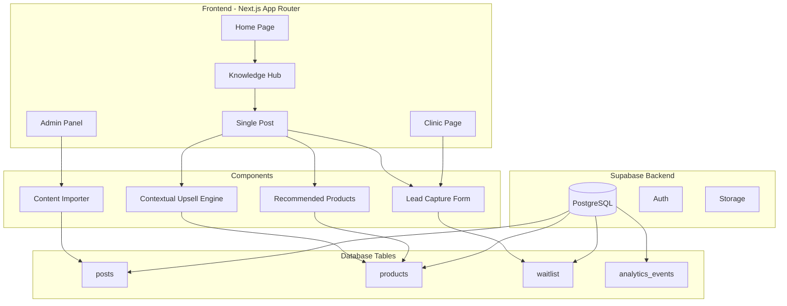

# Design Document: Lipedema Authority Platform

## Overview

פלטפורמת B2C Authority לליפאדמה המבוססת על Next.js 14+ עם App Router ו-Supabase כ-backend. המערכת מיישמת את מודל 80/20 - 80% תוכן לבניית סמכות ו-20% מנועי הכנסה. הארכיטקטורה מתבססת על הסכמה הקיימת ב-Supabase (posts, products, waitlist) ומרחיבה אותה לתמיכה במונטיזציה קונטקסטואלית.

## Architecture



## Components and Interfaces

### 1. Knowledge Hub Component

```typescript
// src/app/knowledge/page.tsx
interface KnowledgeHubProps {
  initialCategory?: CategorySlug;
  searchQuery?: string;
}

type CategorySlug = 'diagnosis' | 'nutrition' | 'physical' | 'mindset' | 'all';

interface CategoryConfig {
  slug: CategorySlug;
  display: string;
  icon: string;
  description: string;
}

const CATEGORIES: CategoryConfig[] = [
  { slug: 'all', display: 'הכל', icon: 'Grid', description: 'כל המאמרים' },
  { slug: 'diagnosis', display: 'אבחון וזיהוי', icon: 'Search', description: 'זיהוי סימפטומים ואבחון' },
  { slug: 'nutrition', display: 'תזונה ונוטריציה', icon: 'Apple', description: 'מתכונים ותזונה אנטי-דלקתית' },
  { slug: 'physical', display: 'טיפול פיזי ושיקום', icon: 'Heart', description: 'עיסוי לימפתי וגרבי לחץ' },
  { slug: 'mindset', display: 'מיינדסט ורגש', icon: 'Brain', description: 'התמודדות עם דימוי גוף' },
];
```

### 2. Contextual Upsell Engine

```typescript
// src/components/monetization/ContextualUpsell.tsx
interface ContextualUpsellProps {
  postTags: string[];
  monetizationStrategy: MonetizationStrategy;
  postId: string;
}

type MonetizationStrategy = 
  | 'Affiliate (Products)' 
  | 'Low Ticket (Digital Guide)' 
  | 'High Ticket (Clinic Lead)';

interface UpsellConfig {
  strategy: MonetizationStrategy;
  productType: 'Physical' | 'Digital' | null;
  showClinicCTA: boolean;
  ctaStyle: 'prominent' | 'subtle' | 'hidden';
}

function getUpsellConfig(strategy: MonetizationStrategy): UpsellConfig {
  switch (strategy) {
    case 'Affiliate (Products)':
      return { strategy, productType: 'Physical', showClinicCTA: false, ctaStyle: 'subtle' };
    case 'Low Ticket (Digital Guide)':
      return { strategy, productType: 'Digital', showClinicCTA: false, ctaStyle: 'prominent' };
    case 'High Ticket (Clinic Lead)':
      return { strategy, productType: null, showClinicCTA: true, ctaStyle: 'prominent' };
  }
}
```

### 3. Lead Capture Form

```typescript
// src/components/clinic/LeadCaptureForm.tsx
interface LeadCaptureFormProps {
  source: 'header' | 'footer' | 'article' | 'clinic-page';
  postId?: string;
}

interface LeadFormData {
  name: string;
  email: string;
  phone?: string;
  treatment_interest: TreatmentInterest[];
  quiz_answers?: QuizAnswers;
}

type TreatmentInterest = 
  | 'consultation'
  | 'nutrition_plan'
  | 'lymphatic_massage'
  | 'compression_therapy'
  | 'mindset_coaching';

interface QuizAnswers {
  diagnosed: boolean;
  stage?: 1 | 2 | 3 | 4;
  main_symptoms: string[];
  tried_treatments: string[];
  goals: string[];
}

interface FormValidation {
  isValid: boolean;
  errors: Record<string, string>;
}

function validateLeadForm(data: LeadFormData): FormValidation {
  const errors: Record<string, string> = {};
  
  if (!data.name.trim()) {
    errors.name = 'נא להזין שם';
  }
  
  if (!data.email.trim()) {
    errors.email = 'נא להזין אימייל';
  } else if (!isValidEmail(data.email)) {
    errors.email = 'פורמט אימייל לא תקין';
  }
  
  return {
    isValid: Object.keys(errors).length === 0,
    errors
  };
}
```

### 4. Content Importer

```typescript
// src/lib/import/contentImporter.ts
interface InstagramPost {
  id: string;
  title: string;
  content: string;
  image_url: string;
  date: string;
  likes: number;
  category_slug: CategorySlug;
  category_display: string;
  monetization_strategy: MonetizationStrategy;
  original_url: string;
}

interface ImportResult {
  success: boolean;
  imported: number;
  skipped: number;
  errors: ImportError[];
}

interface ImportError {
  postId: string;
  reason: string;
}

function parseInstagramExport(jsonData: string): InstagramPost[] | null {
  // Parse and validate JSON structure
}

function generateSlug(title: string): string {
  // Generate URL-safe slug from Hebrew title
}

async function importPosts(posts: InstagramPost[]): Promise<ImportResult> {
  // Import posts to Supabase with draft status
}
```

### 5. Product Matching Engine

```typescript
// src/lib/products/matchingEngine.ts
interface ProductMatch {
  product: Product;
  matchScore: number;
  matchedTags: string[];
}

function matchProductsToPost(
  postTags: string[],
  products: Product[],
  productType?: 'Physical' | 'Digital'
): ProductMatch[] {
  return products
    .filter(p => p.active)
    .filter(p => !productType || p.type === productType)
    .map(product => {
      const matchedTags = (product.trigger_tags || [])
        .filter(tag => postTags.some(pt => 
          pt.toLowerCase() === tag.toLowerCase()
        ));
      
      return {
        product,
        matchScore: matchedTags.length,
        matchedTags
      };
    })
    .filter(match => match.matchScore > 0)
    .sort((a, b) => b.matchScore - a.matchScore);
}
```

## Data Models

### Extended Database Schema

```sql
-- Extend posts table with monetization fields
ALTER TABLE posts ADD COLUMN IF NOT EXISTS 
  monetization_strategy TEXT DEFAULT 'Low Ticket (Digital Guide)';
ALTER TABLE posts ADD COLUMN IF NOT EXISTS 
  original_url TEXT;
ALTER TABLE posts ADD COLUMN IF NOT EXISTS 
  category_display TEXT;

-- Analytics events table
CREATE TABLE IF NOT EXISTS analytics_events (
  id UUID PRIMARY KEY DEFAULT gen_random_uuid(),
  event_type TEXT NOT NULL, -- 'page_view', 'affiliate_click', 'lead_submit'
  post_id UUID REFERENCES posts(id),
  product_id UUID REFERENCES products(id),
  metadata JSONB,
  created_at TIMESTAMPTZ DEFAULT NOW()
);

-- Index for analytics queries
CREATE INDEX idx_analytics_event_type ON analytics_events(event_type);
CREATE INDEX idx_analytics_created_at ON analytics_events(created_at);
```

### TypeScript Types Extension

```typescript
// src/types/database.ts (extended)
export type MonetizationStrategy = 
  | 'Affiliate (Products)' 
  | 'Low Ticket (Digital Guide)' 
  | 'High Ticket (Clinic Lead)';

export interface ExtendedPost extends Post {
  monetization_strategy: MonetizationStrategy;
  original_url: string | null;
  category_display: string;
}

export interface AnalyticsEvent {
  id: string;
  event_type: 'page_view' | 'affiliate_click' | 'lead_submit';
  post_id: string | null;
  product_id: string | null;
  metadata: Record<string, unknown>;
  created_at: string;
}
```


## Correctness Properties

*A property is a characteristic or behavior that should hold true across all valid executions of a system—essentially, a formal statement about what the system should do. Properties serve as the bridge between human-readable specifications and machine-verifiable correctness guarantees.*


### Property 1: Category Filtering Correctness

*For any* category selection and any set of posts, all posts returned by the filter function should have a category_slug that matches the selected category (or all posts if 'all' is selected).

**Validates: Requirements 1.2**

### Property 2: Post Display Completeness

*For any* post object with all required fields (title, content, excerpt, image_url, tags, category_display, date, original_url), the rendered post display should contain all of these fields in the output.

**Validates: Requirements 1.3, 1.7, 2.4**

### Property 3: Search Filtering Correctness

*For any* search query string and any set of posts, all posts returned by the search function should contain the query string in at least one of: title, content, or tags array.

**Validates: Requirements 1.4**

### Property 4: Related Posts Tag Overlap

*For any* post with tags and any set of related posts returned, each related post should share at least one tag with the original post.

**Validates: Requirements 1.6**

### Property 5: Tag Storage Round-Trip

*For any* post with a tags array, storing the post and then retrieving it should return the same tags array (order may differ).

**Validates: Requirements 2.2**

### Property 6: Product-Post Tag Matching

*For any* post with tags and monetization_strategy, the products returned by the matching engine should have trigger_tags that overlap with the post's tags, and should be filtered by the appropriate product type (Physical for Affiliate, Digital for Low Ticket).

**Validates: Requirements 3.1, 4.1, 4.6**

### Property 7: Product Display Completeness

*For any* product object with all required fields (name, image_url, description, price, affiliate_link), the rendered product display should contain all of these fields in the output.

**Validates: Requirements 3.2, 4.2**

### Property 8: Affiliate Link Security Attributes

*For any* rendered affiliate link element, the element should have target="_blank" and rel="noopener noreferrer" attributes.

**Validates: Requirements 3.3**

### Property 9: Analytics Event Creation

*For any* tracked action (page view, affiliate click, lead submission), an analytics event should be created with the correct event_type and associated post_id or product_id.

**Validates: Requirements 3.4, 8.1, 8.3**

### Property 10: Product Type Prioritization

*For any* set of matched products for an Affiliate post, products with type "Physical" should appear before products with type "Digital" in the sorted results.

**Validates: Requirements 3.6**

### Property 11: Recommended Label for Matching Products

*For any* Digital product that matches a post's tags, the rendered display should include the "מומלץ עבורך" label.

**Validates: Requirements 4.5**

### Property 12: Clinic CTA in High Ticket Posts

*For any* post with monetization_strategy "High Ticket (Clinic Lead)", the rendered post should contain the clinic CTA component within the article content.

**Validates: Requirements 5.2**

### Property 13: Form Validation Correctness

*For any* form submission data, the validation function should return errors for: empty name, empty email, invalid email format. Valid submissions should pass validation.

**Validates: Requirements 5.4, 5.7**

### Property 14: Lead Storage Round-Trip

*For any* valid lead form submission, storing the waitlist entry and then retrieving it should return the same name, email, phone, treatment_interest, and quiz_answers.

**Validates: Requirements 5.5**

### Property 15: JSON Import Parsing

*For any* valid JSON array in the site_content_db.json format, the parser should successfully extract all posts. For any malformed JSON, the parser should return an error.

**Validates: Requirements 6.1**

### Property 16: Import Field Mapping Round-Trip

*For any* imported Instagram post, the created draft post should have: a slug generated from the title, published set to false, and original_url preserved from the source.

**Validates: Requirements 6.2, 6.3, 6.6**

### Property 17: Product Validation

*For any* product creation or update, the system should reject: missing name, missing type, missing price, missing affiliate_link, or invalid URL format for affiliate_link.

**Validates: Requirements 7.2, 7.5**

### Property 18: Product Update Round-Trip

*For any* product update operation, the updated fields should be persisted and retrievable with the new values.

**Validates: Requirements 7.3**

### Property 19: Product Active Status Filtering

*For any* product with active=false, the product should not appear in public-facing product queries (only in admin queries).

**Validates: Requirements 7.4**

### Property 20: Product-Post Match Preview

*For any* product with trigger_tags, the admin view should correctly display all posts whose tags overlap with the product's trigger_tags.

**Validates: Requirements 7.6**

## Error Handling

### Form Validation Errors

```typescript
const ERROR_MESSAGES = {
  name: {
    required: 'נא להזין שם',
  },
  email: {
    required: 'נא להזין אימייל',
    invalid: 'פורמט אימייל לא תקין',
  },
  phone: {
    invalid: 'מספר טלפון לא תקין',
  },
  affiliate_link: {
    required: 'נא להזין קישור',
    invalid: 'פורמט URL לא תקין',
  },
};
```

### Import Errors

```typescript
interface ImportError {
  type: 'parse_error' | 'validation_error' | 'database_error';
  message: string;
  details?: {
    postId?: string;
    field?: string;
    value?: unknown;
  };
}

function handleImportError(error: ImportError): string {
  switch (error.type) {
    case 'parse_error':
      return `שגיאה בפענוח הקובץ: ${error.message}`;
    case 'validation_error':
      return `שגיאת אימות בפוסט ${error.details?.postId}: ${error.message}`;
    case 'database_error':
      return `שגיאה בשמירה למסד הנתונים: ${error.message}`;
  }
}
```

### API Error Responses

```typescript
interface ApiError {
  code: string;
  message: string;
  field?: string;
}

const API_ERRORS = {
  VALIDATION_FAILED: { code: 'VALIDATION_FAILED', message: 'אימות נכשל' },
  NOT_FOUND: { code: 'NOT_FOUND', message: 'לא נמצא' },
  UNAUTHORIZED: { code: 'UNAUTHORIZED', message: 'אין הרשאה' },
  DATABASE_ERROR: { code: 'DATABASE_ERROR', message: 'שגיאת מסד נתונים' },
};
```

## Testing Strategy

### Unit Tests

Unit tests will focus on:
- Form validation logic (validateLeadForm, validateProduct)
- URL validation (isValidUrl, isValidEmail)
- Slug generation (generateSlug)
- Product matching logic (matchProductsToPost)
- Category filtering logic
- Search filtering logic

### Property-Based Tests

Property-based tests will use **fast-check** library for TypeScript/JavaScript.

Configuration:
- Minimum 100 iterations per property test
- Each test tagged with: **Feature: lipedema-authority-platform, Property {number}: {property_text}**

Property tests will cover:
1. Category filtering correctness
2. Search filtering correctness
3. Product-post tag matching
4. Form validation completeness
5. Round-trip properties for data storage
6. Import parsing and field mapping

### Integration Tests

Integration tests will verify:
- Supabase queries return expected data
- Form submissions create waitlist entries
- Analytics events are tracked correctly
- Product active status affects visibility

### Test File Structure

```
src/
├── lib/
│   ├── validation/
│   │   ├── formValidation.ts
│   │   └── formValidation.test.ts
│   ├── products/
│   │   ├── matchingEngine.ts
│   │   └── matchingEngine.test.ts
│   ├── import/
│   │   ├── contentImporter.ts
│   │   └── contentImporter.test.ts
│   └── search/
│       ├── postSearch.ts
│       └── postSearch.test.ts
└── components/
    └── __tests__/
        └── integration/
```
